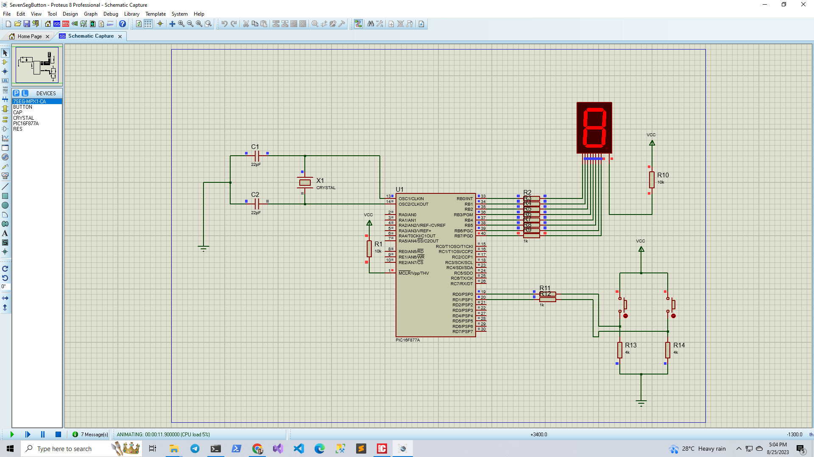

# Microcontroller
## Seven Segment two digit
## You can only follow Circuit design Proteus 8 Professional-- SevenSegButton.pdsprj
## You can only follow mikroC PRO for PIC code -- Seven_Segmentwithbutton.c

